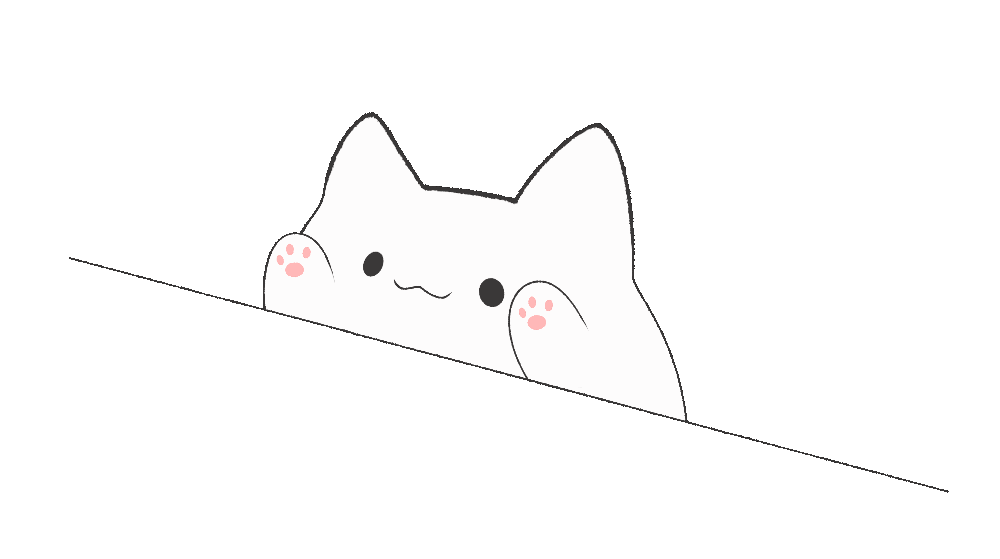

   <head>
      <meta charset="utf-8">
      <link rel="stylesheet" href="buttonDadong.css">
      <link rel="stylesheet" href="menu.css">
      <link rel="stylesheet" href="https://cdnjs.cloudflare.com/ajax/libs/font-awesome/5.15.3/css/all.min.css"/>
      
	   
   </head>
   <body>
      <input type="checkbox" id="active">
      <button for="active" onclick="muncha.play();" class="menu-btn"><i class="fas fa-bars"></i></button>
      

         <ul>
            <li><a href="#">Home</a></li>
            <li><a href="#">About</a></li>
            <li><a href="#">Gallery</a></li>
         </ul>
	 
      

      

	      <button onclick="dadong.play();" class="dadong">DaDong~</button>
         

		
         

	

	   
   </body>
